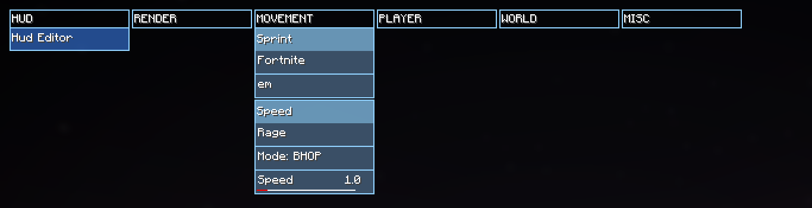

# Doovids Utilities

## Setup

Open the project in cmd, run 'gradlew build' and place the built jar file in '~/pathtomcversion/mods' with
minecraft version 26.2 and fabric installed. 
Working ClickGUI and Settings with more features to be added in the near future.

Picture of the GUI as of commit faa07bb6b042d462c9fd4da30ba25525da3636c8

## License

This template is available under the CC0 license.
